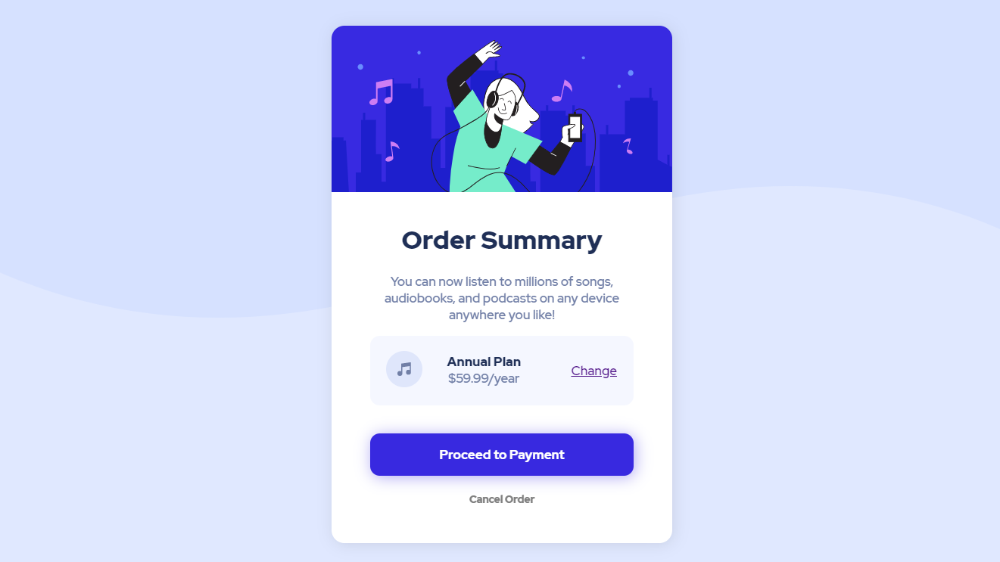

# Frontend Mentor - Order summary card solution

This is a solution to the [Order summary card challenge on Frontend Mentor](https://www.frontendmentor.io/challenges/order-summary-component-QlPmajDUj).

## Table of contents

- [Screenshot](#screenshot)
- [Link](#link)
- [Built with](#built-with)
- [Project Takeaways](#project-takeaways)

### Screenshot

### Link

Solution URL: [Click Here](https://matejgroombridge.github.io/Order-Summary-Component/)

### Built with

- HTML5
- SCSS
- Desktop First Workflow

### Project Takeaways

- Better understanding of Flexbox and Grid
- I learnt how to use Git and Github
- More problem solving skills
